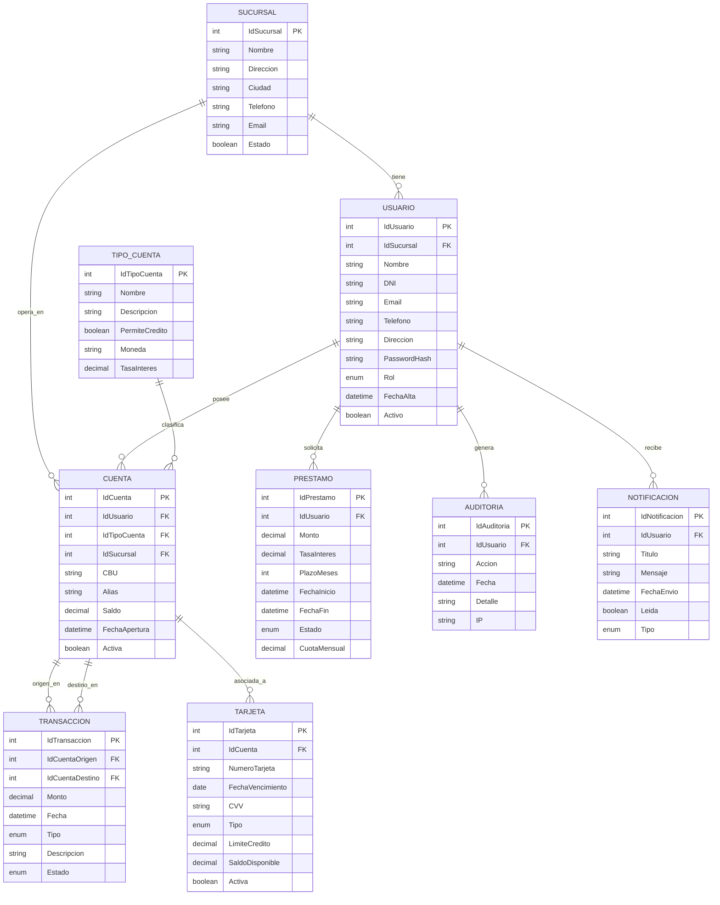

<h1 align="center"> E.T. Nº12 D.E. 1º "Libertador Gral. José de San Martín" </h1>
<p align="center">
  
</p>

## Computación : 2025

**Nombre TP**: EduBank

**Apellido y Nombre Alumno**: Verdugues Miguel, Guzman Josu, Tito Joel, Mendoza Davis, Bruno Carlos

**Curso**: 6 ° 7

# EduBank
Este proyecto es un Sistema Bancario Backend desarrollado con Node.js y Express que proporciona una API RESTful completa para gestionar operaciones bancarias. El sistema incluye módulos para:

- Gestión de Usuarios (clientes, empleados, gerentes)
- Sucursales Bancarias
- Tipos de Cuentas (Caja de Ahorro, Cuenta Corriente, etc.)
- Cuentas Bancarias con CBU único
- Transacciones (transferencias, depósitos, retiros)
- Tarjetas (débito y crédito)
- Préstamos
- Auditoría de operaciones
- Notificaciones a usuarios

```shell
 mysql --default-character-set=utf8mb4 -u mysql-user -p
```

<h3 align="center"> Diagrama de clases del Proyecto </h3>




## Comenzando 🚀

Clonar el repositorio github, desde Github Desktop o ejecutar en la terminal o CMD:

```
https://github.com/JosuGuzman/EduBank
```
Y instalar depedencias:
```
npm install
```

## Pre-requisitos 📋
- Node.js (versión 16 o superior)
- Visual Studio Code - [Descargar](https://code.visualstudio.com/#alt-downloads)
- Git - [Descargar](https://git-scm.com/downloads)
- MySQL - [Descargar](https://dev.mysql.com/downloads/mysql/)
- npm o yarn como gestor de paquetes

## Despliegue 📦

_Para iniciar el proyecto primero debe desplegar la base de datos y para eso tiene que hacer segundo click en la carpeta scripts sql_
_y presionar en terminal integrado, le aparecera una terminal donde tiene que poner lo siguiente:_

```
mysql -u tuUsuario -p 
:tuContraseña
```
